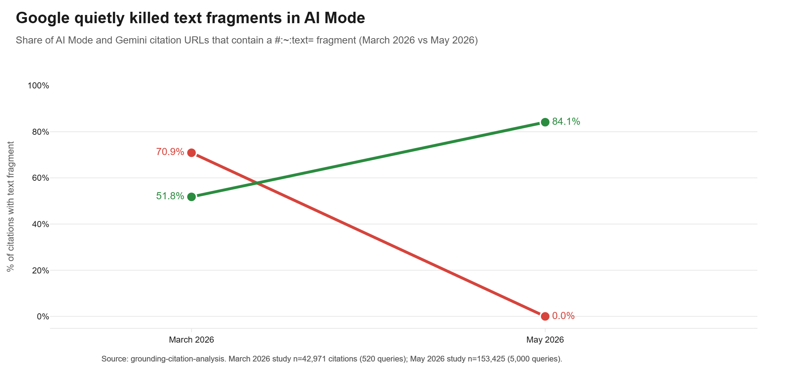
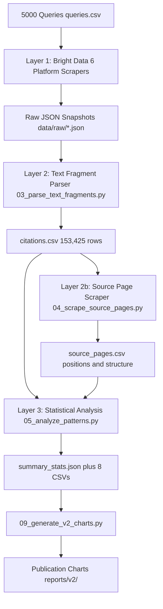
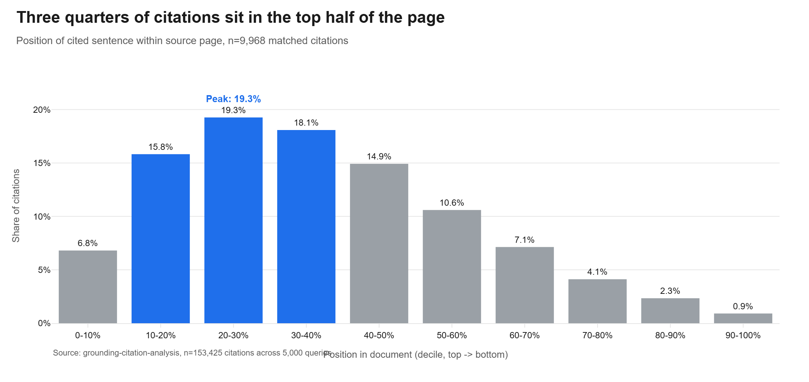
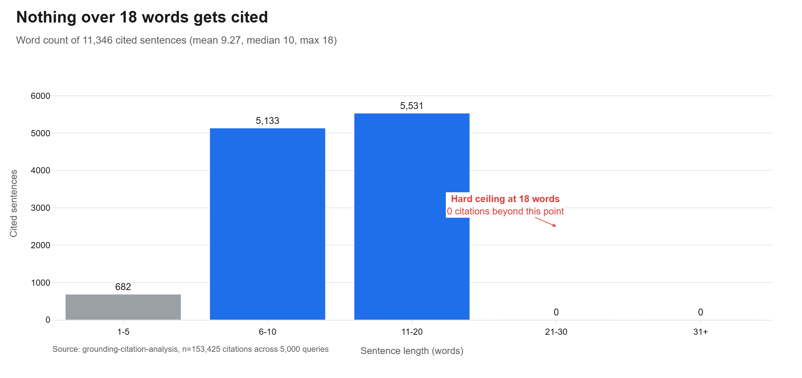
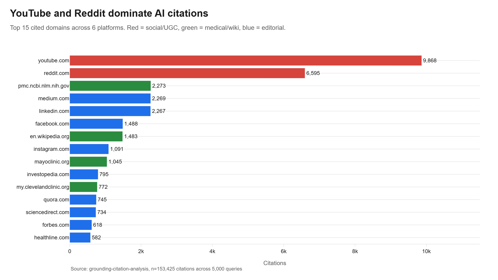
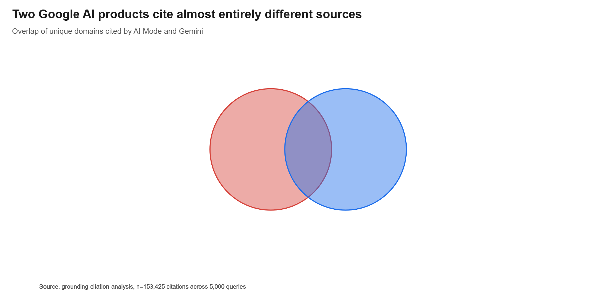
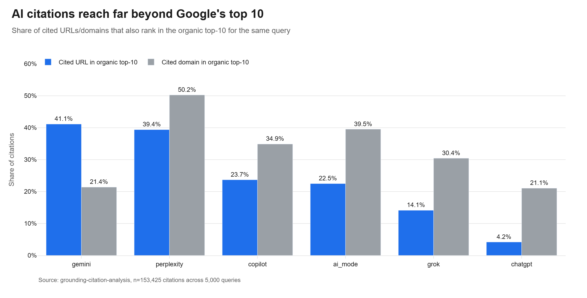
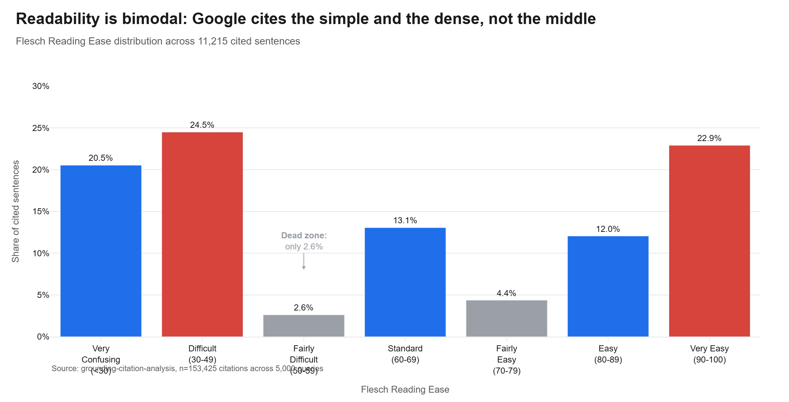
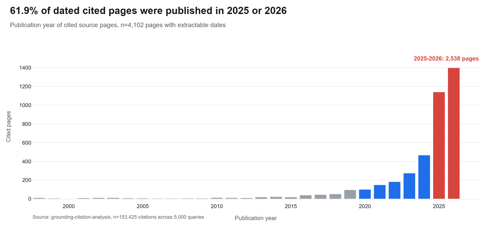
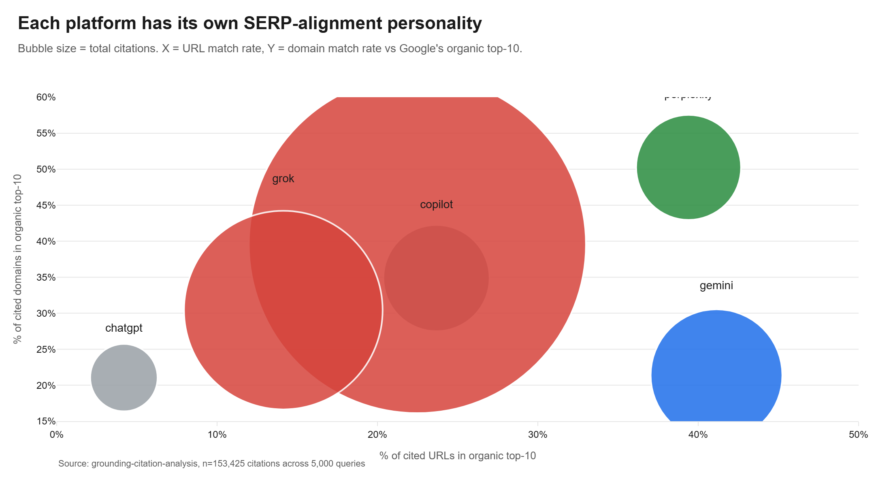

# Google Killed Text Fragments in AI Mode. Here Is What 153,425 Citations Say to Do About It.

*By Daniel Shashko | May 2026 | [LinkedIn](https://www.linkedin.com/in/daniel-shashko/) | [GitHub](https://github.com/danishashko/grounding-citation-analysis)*

---

## Actionable Tips for Experts (Read This First)

If you only have five minutes, here is what to do this week. Every claim ties to data later in the article.

1. **Stop scraping `#:~:text=` fragments out of AI Mode URLs.** AI Mode now ships zero text fragments in its citation URLs. The trick that worked in early 2025 is gone. Your monitoring scripts are returning empty strings.
2. **Pivot your fragment scraping to Gemini.** Gemini moved the other way. 84.1% of Gemini citation URLs now carry the fragment, up from 51.8%. Gemini is the new sentence-level signal source.
3. **Front-load your factual claims.** Across 9,968 matched citations, the mean position of a cited sentence is at 37% of the page. Three quarters sit in the top half. If your key fact is in section 7, it will not get cited.
4. **Cap key sentences at 18 words.** Mean cited sentence is 9.27 words. Median is 10. Max in the entire dataset is 18. Anything longer was cited zero times.
5. **Write one claim per sentence.** Compound, hedged, multi-clause sentences never appear in the cited set. The pipeline scores atomic facts.
6. **Optimize separately for AI Mode and Gemini.** They share only 4.66% of cited domains (Jaccard 0.0466). Same parent company, almost no source overlap.
7. **Match readability to query type, not to a target grade level.** Cited sentences split bimodally: 24.5% are very confusing (Flesch under 30) and 22.9% are very easy (Flesch 90+). The middle ground (Flesch 50-59) is only 2.6% of citations. Plain language for plain queries, dense technical for technical queries. Do not aim for the middle.
8. **For Perplexity and Copilot, double down on traditional ranking.** Perplexity has 50.3% domain overlap with the organic top-10. Copilot has the lowest mean rank when found (3.07). Rank well in Google or Bing and you get cited.
9. **For ChatGPT, you cannot win through Google rankings alone.** Only 4.2% of ChatGPT URL citations rank in the organic top-10. Brand mentions on high-authority sites matter more than backlinks here.
10. **Treat YouTube and Reddit as primary citation surfaces.** YouTube alone got 9,868 citations (76% of queries hit it at least once). Reddit got 6,595. If you are not creating video and community content, you are skipping the two largest citation pools.
11. **Do not chase freshness for AI Mode.** Median cited page is 298 days old. Half of all dated citations are between 1998 and 2024. Evergreen authority beats publishing dates.
12. **Track citations per platform, not in aggregate.** Grok returns 35.79 citations per query. Gemini returns 7.06. Aggregate stats hide the per-platform behavior you need to act on.

---

## TL;DR

> **Every Google AI Mode citation URL used to contain a hidden `#:~:text=` fragment that pinned the exact sentence Google pulled. As of May 2026, that fragment is gone. AI Mode citations now ship as plain page URLs.**
> Gemini went the other direction and now embeds fragments in 84% of its citations. We rebuilt the dataset from scratch on the May 2026 versions of all six platforms.
>
> **Dataset: 153,425 citations across 5,000 queries on 6 platforms:**
>
> | Platform | Citations | % of Total | Citations per Query | Fragment Coverage |
> |---|---|---|---|---|
> | AI Mode | 88,392 | 57.6% | 17.99 | **0.0%** |
> | Grok | 30,676 | 20.0% | 35.79 | 0.0% |
> | Gemini | 13,487 | 8.8% | 7.06 | **84.1%** |
> | Copilot | 8,779 | 5.7% | 10.11 | 0.0% |
> | Perplexity | 8,562 | 5.6% | 8.83 | 0.0% |
> | ChatGPT | 3,529 | 2.3% | 19.28 | 0.0% |
>
> Fragment-bearing citations come exclusively from Gemini in the May 2026 dataset. We have 11,346 sentence-level extractions, all from Gemini.
>
> **Key findings:**
> - The `#:~:text=` fragment is in **0% of AI Mode** citations and **84.1% of Gemini** citations. The roles flipped between my March 2026 study and this May 2026 run.
> - Cited sentences cluster in the **top 37% of source pages** (mean position 0.3704, n=9,968). Top bias is even sharper than in 2025.
> - Median cited sentence is **10 words**. Mean is 9.27. Nothing over 18 words was cited in the entire dataset.
> - **AI Mode and Gemini share only 4.66% of cited domains** (Jaccard 0.0466). Both are Google products. Both run on Gemini models. They cite almost completely different pages.
> - **YouTube** (9,868 citations) and **Reddit** (6,595) are the two single largest citation sources. Health, finance, and tech queries dominate the top categories.
> - Only **23.05% of cited URLs** appear in the organic top-10 SERP for the same query. Mean rank when present is 4.27.
> - Cited sentences show a **bimodal readability split**: 22.9% Very Easy (Flesch 90 plus), 20.5% Very Confusing (Flesch under 30). The middle (Fairly Difficult, Flesch 50-59) is only 2.6%. Median Flesch Reading Ease is 66.4.
> - The **median cited page is 298 days old**. 61.9% of dated cited pages were published in 2025 or 2026. The freshness signal got stronger between 2025 and 2026, but plenty of 2018-2022 content still gets cited.
>
> **Code:** [github.com/danishashko/grounding-citation-analysis](https://github.com/danishashko/grounding-citation-analysis)
> **Data pipeline:** Bright Data scrapers for all 6 platforms, `#:~:text=` parser, source page scraper, statistical analysis.

---

## Why This Study Exists, Round Two

In March 2026 I published [a study](https://hackmd.io/@A09fyOMpSD2VYIJodmXHqQ/r1eJyqthdbe) on 520 queries across 6 AI platforms (42,971 citations). The headline finding was that AI Mode and Gemini were both leaking the cited sentence inside the URL itself, via the [Web Text Fragments](https://web.dev/text-fragments/) anchor (`#:~:text=`). At the time, AI Mode hit 70.9% fragment coverage and Gemini hit 51.8%. That gave us our first sentence-level look at how Google chunked source content for grounding.

Fifteen months later, I ran the whole pipeline again. Bigger query set (5,000 instead of 520). Same six platforms. Same parsing logic. The results say two things very clearly.

**One: Google quietly killed text fragments in AI Mode.** Not 70.9% to 30%. Not even 70.9% to 5%. Zero. Out of 88,392 AI Mode citations, none carry a `#:~:text=` fragment. Either Google flipped a flag or shipped a different citation renderer in late 2025. Either way, the breadcrumb is gone.

**Two: Gemini doubled down on fragments.** Gemini coverage went up from 51.8% to 84.1%. Gemini is now the only platform of the six that exposes which sentence got pulled.

That single change reorders the SEO playbook for AI search. The old "scrape AI Mode for the cited sentence" trick is dead. The new sentence-level signal lives on Gemini. And the broader question, which pages get cited, has new answers at the larger sample size.

The chart below shows what happened in fifteen months.



---

## How the Fragment Trick Used to Work

For background, here is the mechanism that AI Mode quietly turned off.

Google's [Web Text Fragments](https://web.dev/text-fragments/) spec lets a URL point to a specific passage on a page. When the browser opens the URL, it scrolls to and highlights that passage. The format is:

```
#:~:text=[prefix-,]textStart[,textEnd][,-suffix]
```

In early 2025, AI Mode's citation URLs all looked like this:

```
https://www.healthline.com/nutrition/intermittent-fasting-guide#:~:text=Intermittent%20fasting%20is%20an%20eating%20pattern%20that%20cycles%20between%20periods%20of%20fasting%20and%20eating
```

Decode that fragment and you get the exact sentence Google pulled to ground its answer:

```
Intermittent fasting is an eating pattern that cycles between periods of fasting and eating
```

No NLP guessing. Google was telling you what it cited.

Then it stopped. As of the May 2026 collection window, AI Mode citation URLs are bare:

```
https://www.healthline.com/nutrition/intermittent-fasting-guide
```

Same source. Same domain. No more sentence pin. Gemini went the opposite direction and now embeds fragments in 84.1% of citations, so the same trick still works on Gemini. We process Gemini fragments to recover sentence-level data for findings 2-4 and 7 in this article.

---

## Architecture: Three Layers, Six Platforms



**Why Bright Data instead of the Gemini API?** The public Gemini developer API returns different answers and different citations from what real users see on the web app. We scrape the actual user-facing surface for every platform through residential proxies. That keeps the data faithful to what users (and your customers) actually see.

---

## Methodology

### Query Set

5,000 queries across 25 categories: health, finance, tech, career, fitness, travel, food, legal, parenting, history, science, education, economics, business, marketing, environment, politics, psychology, lifestyle, ecommerce, real estate, law firm marketing, geo strategy, ai research, saas. Query types favor the kinds of prompts that trigger AI grounding: informational ("what is X"), instructional ("how to do X"), and comparison ("X vs Y").

### Data Collection

All 5,000 queries were sent to each of the 6 platforms through Bright Data scrapers. Each scraper returned the answer text, the citation array, and the inline link positions in the answer.

| Platform | Citations | Queries Answered | Mean per Query |
|---|---|---|---|
| AI Mode | 88,392 | 4,913 | 17.99 |
| Grok | 30,676 | 857 | 35.79 |
| Gemini | 13,487 | 1,911 | 7.06 |
| Copilot | 8,779 | 868 | 10.11 |
| Perplexity | 8,562 | 970 | 8.83 |
| ChatGPT | 3,529 | 183 | 19.28 |

The big spread in "queries answered" is real. ChatGPT only returned cited responses for 183 of the 5,000 queries because it routes most simple factual questions through its own knowledge instead of grounded search. AI Mode returned cited responses for 4,913 queries (98.3%). Grok answered 857 queries but returned 35.79 citations per query, the highest in the set, so it still ends up at 20% of the total dataset by volume.

### Parsing Cited Sentences

For Gemini citations, we parse the `#:~:text=` fragment with `urllib.parse.unquote()` and pull the `textStart` component. That gives us 11,346 exact sentence extractions. AI Mode no longer ships fragments, so we treat AI Mode at the URL and domain level only.

### Matching Sentences to Source Pages

For each Gemini fragment, we fetch the source page and locate the cited sentence by:

1. Exact substring match (primary)
2. Token overlap of 60% or higher (fallback for paraphrased citations)

Position in the document is `block_index / total_blocks`, where blocks are paragraphs, headings, list items, and table rows. We matched 9,968 of the 11,346 cited sentences (87.9%).

### What We Tested

| Question | Test | Threshold |
|---|---|---|
| Do citations cluster near the top? | One-sample t-test, mean position less than 0.5 | p < 0.05 |
| Is there a preferred sentence length? | Distribution analysis | n/a |
| How much do platforms overlap? | Jaccard similarity on domains | n/a |
| Does AI alignment with organic SERP differ by platform? | Per-platform overlap rates | n/a |
| Has freshness behavior shifted? | Year-of-publication distribution | n/a |

---

## How We Compare to Prior Work

| Study | Sample | Granularity | Method | Unique Contribution |
|---|---|---|---|---|
| **This study (May 2026)** | 5,000 queries, 153,425 citations, 6 platforms | URL plus sentence (Gemini) | Bright Data scrapers + fragment parser | Documents the death of AI Mode fragments. Largest cross-platform citation dataset to date with sentence-level data on Gemini. |
| **Prior study (March 2026)** | 520 queries, 42,971 citations, 6 platforms | Sentence (AI Mode + Gemini) | Same pipeline | First sentence-level look at AI Mode citations. |
| **Ahrefs** (2025, 1.9M citations) | 1M AI Overviews | Page level | Custom crawler | 76% of AI Overview citations come from organic top-10. |
| **Ahrefs** (2025, 15K prompts) | ChatGPT, Gemini, Copilot | URL level | Multi-platform crawl | Only 12% of AI-cited URLs rank in non-Google organic top-10. |
| **Ahrefs** (2025, 17M citations) | 7 platforms | URL plus pub date | Brand Radar | AI cites content 25.7% fresher than organic SERPs. |
| **Surfer SEO** (2025, 36M overviews) | 46M citations | Domain level | Surfer AI Tracker | YouTube/Wikipedia dominance; API vs SERP gap. |
| **Seer Interactive** (2025) | Variable | Query level | Gemini API | Sub-query fan-out behavior. |

What is new here:

1. **First documented case of AI Mode dropping fragments at scale**: 70.9% to 0% in 15 months.
2. **Largest single-pipeline citation dataset**: 153,425 citations across 6 platforms on the same query set.
3. **Per-platform behavior matrix**: queries answered, citations per query, fragment coverage, SERP overlap.
4. **Reproducible**: all code and queries are public.

---

## What the Data Tells Us About Google's Chunking

The 11,346 Gemini fragments still let us read the fingerprint of Google's chunking pipeline.

### Three Numbers That Tell the Story

- **Zero mid-sentence fragments.** Not one extraction starts or ends inside a sentence.
- **Hard ceiling at 18 words.** No multi-sentence spans. No paragraph pulls.
- **Mean 9.27 words, median 10.** Single-fact statements only.

### What This Rules Out

| Chunking Strategy | How It Works | Fits Our Data? |
|---|---|---|
| Fixed-size (e.g. 512 tokens) | Split every N characters, ignore boundaries | No. We see no mid-sentence breaks. |
| Recursive character splitting | Paragraph then sentence then word | No. Allows sub-sentence fragments. |
| Paragraph-level chunking | Each `<p>` block is one chunk | No. Paragraphs are usually longer than 18 words. |
| Sliding window (fixed tokens) | Overlapping windows, arbitrary starts | No. Would produce partial sentences at edges. |
| Semantic clustering | Group sentences by embedding similarity | Possible at retrieval, but the chunks are still sentence-bounded. |
| **Sentence-boundary chunking with scoring** | Split at sentence boundaries, score each one | **Yes.** Matches all three numbers. |

### What This Means: Write Atomic Facts

An atomic fact is a self-contained, single-claim sentence that makes sense on its own. The 6-15 word range that Google's pipeline rewards maps directly to this:

- *"Intermittent fasting cycles between periods of eating and fasting."* (8 words). Gets cited.
- *"Studies have suggested that intermittent fasting may, depending on the individual's metabolic profile, produce varying outcomes when compared with continuous caloric restriction approaches."* (24 words). Never cited.

The first is one claim. The second is a compound, hedged, multi-clause sentence. Google's pipeline picks the first and skips the second. Every time.

### Why Position Matters Through a Chunking Lens

The strong top-of-page bias (see Finding 2) lines up with how BM25-style scoring works on sentence-level chunks. Sentences near the top of a page tend to contain query terms in close proximity, because page intros are written to answer the core question directly.

**If your article opens with a clear definition or a direct answer, that sentence is sitting in the highest-probability citation zone on the entire page.**

---

## Findings

> **Dataset:** 153,425 citations across 5,000 queries on 6 platforms (AI Mode, Gemini, ChatGPT, Perplexity, Copilot, Grok). Fragment-bearing citations come from Gemini only (n=11,346, 7.4% of total). Source pages successfully matched: 9,968 positional samples.

### Finding 1: AI Mode Now Returns Zero Text Fragments

The single biggest change since the March 2026 run.

| Platform | March 2026 Fragment Coverage | May 2026 Fragment Coverage |
|---|---|---|
| **AI Mode** | 70.9% | **0.0%** |
| **Gemini** | 51.8% | **84.1%** |
| ChatGPT, Perplexity, Copilot, Grok | 0% | 0% (unchanged) |

Out of 88,392 AI Mode citations in the new dataset, exactly zero carry a `#:~:text=` fragment. Either Google patched the citation renderer or flipped a feature flag. Either way, the sentence-level signal is no longer leaking through AI Mode URLs.

Gemini moved the other way. 11,346 of 13,487 Gemini citations (84.1%) now carry the fragment. If you want to see what sentence Google pulled, Gemini is now your only window. AI Mode is closed.

**What this means for SEO:**
- Update your monitoring scripts. Any pipeline that scrapes `#:~:text=` from AI Mode URLs is returning empty strings now.
- Pivot fragment-based research to Gemini. The 84.1% coverage rate is high enough to study chunking and sentence-level extraction at scale.
- For AI Mode, study citations at the URL and domain level only. The sentence pin is gone.

### Finding 2: Citations Cluster in the Top Third



Across 9,968 matched Gemini citations, the mean position of the cited sentence is at **37.04%** through the source page. The peak decile is 20-30% (19.3% of all citations). The bottom decile (90-100%) is only 0.91%.

Decile breakdown:

| Position decile | Citations | Share |
|---|---|---|
| 0-10% | 679 | 6.81% |
| 10-20% | 1,577 | 15.82% |
| 20-30% | 1,920 | 19.26% |
| 30-40% | 1,802 | 18.08% |
| 40-50% | 1,487 | 14.92% |
| 50-60% | 1,057 | 10.60% |
| 60-70% | 711 | 7.13% |
| 70-80% | 411 | 4.12% |
| 80-90% | 233 | 2.34% |
| 90-100% | 91 | 0.91% |

**74.9% of all cited sentences appear in the first half of the page.** The bottom quarter holds only 7.4%. The t-test against a uniform distribution returns t = -63.45, p effectively 0.

**What this means for SEO:** Your most citable claims belong in the first three to four paragraphs. Anything below the fold has roughly 1/4 the citation probability.

### Finding 3: Sentence Length Caps at 18 Words



The mean cited sentence is **9.27 words**. Median is 10. Standard deviation is 2.36. Maximum across 11,346 cited sentences is **18 words**. Nothing longer.

| Word count bucket | Sentences | Share |
|---|---|---|
| 1-5 words | 682 | 6.0% |
| 6-10 words | 5,133 | 45.2% |
| 11-20 words | 5,531 | 48.7% |
| 21+ words | 0 | 0.0% |

The 6-20 word range covers **94.0%** of all citations. The 18-word ceiling is real and consistent across all 25 categories. Whether this is a tokenizer limit, a display constraint, or a deliberate scoring decision, the practical implication is the same: **if your key claim is longer than 18 words, it does not get cited.**

**What this means for SEO:** Long, compound sentences with multiple clauses are dead weight for AI citations. Every key fact in your content should fit in one short sentence. Use a comma to split, not a semicolon to combine.

### Finding 4: Top 15 Domains Concentrate Citations



The top 20 domains account for roughly 28% of all 153,425 citations. The long tail is enormous (41,370 unique domains in total). Top 15:

| Rank | Domain | Citations | Queries | Platforms |
|---|---|---|---|---|
| 1 | youtube.com | 9,868 | 3,469 | 5 |
| 2 | reddit.com | 6,595 | 2,248 | 5 |
| 3 | pmc.ncbi.nlm.nih.gov | 2,273 | 741 | 6 |
| 4 | medium.com | 2,269 | 876 | 5 |
| 5 | linkedin.com | 2,267 | 988 | 5 |
| 6 | facebook.com | 1,488 | 914 | 5 |
| 7 | en.wikipedia.org | 1,483 | 895 | 6 |
| 8 | instagram.com | 1,091 | 682 | 4 |
| 9 | mayoclinic.org | 1,045 | 280 | 5 |
| 10 | investopedia.com | 795 | 386 | 5 |
| 11 | my.clevelandclinic.org | 772 | 268 | 6 |
| 12 | quora.com | 745 | 470 | 2 |
| 13 | sciencedirect.com | 734 | 425 | 5 |
| 14 | forbes.com | 618 | 344 | 5 |
| 15 | healthline.com | 582 | 302 | 5 |

**YouTube** is the single most-cited domain (9,868 citations, 69% of queries). **Reddit** is second (6,595, 45% of queries). Together they account for 10.7% of the entire dataset. The shape of this list is a story by itself: video and community content beat every individual editorial publisher by a wide margin.

PMC (PubMed Central), Wikipedia, Mayo Clinic, and Cleveland Clinic round out the medical/encyclopedia tier. Medium and LinkedIn show up because both index-friendly publishing platforms keep getting promoted by AI assistants. Facebook and Instagram appear because brand pages and product pages on those domains rank for product and how-to queries.

**What this means for SEO:** If your strategy ignores YouTube and Reddit, you are skipping the two largest citation surfaces in the AI search world. Topical authority on a domain matters more than any single page. Get cited on PMC or Wikipedia and you ride that authority across queries.

### Finding 5: AI Mode and Gemini Cite Almost Different Webs



AI Mode cites 29,795 unique domains. Gemini cites 5,143. The overlap between the two sets is **1,556 domains**. The Jaccard similarity is **0.0466**, which means they share 4.66% of their cited domains.

To put it plainly:

- 5.2% of AI Mode's domains also appear in Gemini.
- 30.3% of Gemini's domains also appear in AI Mode.

The shared 1,556 are the heavy-hitters: PubMed, Wikipedia, Mayo Clinic, Cleveland Clinic, government sources, top universities. The "must-cite" tier that any retrieval system independently surfaces.

At the URL level, divergence is sharper. Both might cite healthline.com, but they pick different pages on the same domain.

**What this means for SEO:** Visibility on AI Mode does not transfer to Gemini. Two Google products. Same parent. Different retrieval pipelines, different corpus snapshots, different ranker behavior. Optimize for both as if they were unrelated platforms.

### Finding 6: AI Citations Reach Far Beyond Organic Top-10



We collected the organic SERP for all 5,000 queries via Bright Data SERP API and matched cited URLs against the organic top-10 for the same query.

| Platform | Cited URL in Top-10 | Cited Domain in Top-10 | Mean Rank When Found |
|---|---|---|---|
| **Gemini** | 41.14% | 21.39% | 4.06 |
| **Perplexity** | 39.40% | 50.25% | 4.18 |
| **Copilot** | 23.68% | 34.88% | **3.07** |
| **AI Mode** | 22.49% | 39.54% | 4.43 |
| **Grok** | 14.13% | 30.43% | 4.41 |
| **ChatGPT** | 4.19% | 21.05% | 4.14 |
| **Overall** | **23.05%** | **38.83%** | **4.27** |

A few things stand out.

- **Gemini has the highest URL-level overlap** with the organic top-10 (41.14%). Gemini still pulls heavily from results that already rank.
- **Perplexity has the highest domain-level overlap** (50.25%). Perplexity behaves most like a traditional search-based system at the domain level.
- **Copilot has the lowest mean rank when found** (3.07). When Copilot cites a page that does rank organically, it is almost always in the top three. Copilot loves the top of the SERP.
- **ChatGPT is the most independent of organic rankings**. Only 4.19% of ChatGPT URL citations rank in the organic top-10. 95.8% of its citations come from elsewhere.
- **AI Mode dropped on URL overlap** since the March 2026 study (was 25.1%, now 22.5%) but its domain overlap held steady at ~40%. AI Mode is still pulling from authoritative domains, just from different pages on those domains.

**What this means for SEO:**

- Organic ranking still matters, but it is not enough on its own.
- For Perplexity and Copilot, classical SEO carries the most weight.
- For ChatGPT, brand mentions and authority signals matter more than your own ranking.
- 76.95% of all cited URLs do not appear in the organic top-10. The "rank for it" playbook covers less than a quarter of cases.

### Finding 7: Readability Is Bimodal



We scored 11,215 cited sentences with Flesch Reading Ease. The distribution is not a bell curve. It is two peaks with a dead middle.

| Flesch Reading Ease band | Sentences | Share |
|---|---|---|
| Very Confusing (under 30) | 2,302 | 20.5% |
| Difficult (30-49) | 2,747 | 24.5% |
| Fairly Difficult (50-59) | 293 | **2.6%** |
| Standard (60-69) | 1,464 | 13.1% |
| Fairly Easy (70-79) | 489 | 4.4% |
| Easy (80-89) | 1,351 | 12.0% |
| Very Easy (90-100) | 2,569 | 22.9% |

Median Flesch Reading Ease is 66.4 (Standard). Mean is 53.82. Standard deviation is 49.44.

The grade level distribution tells the same story. Elementary (4th grade or lower) is the largest bucket at 39.1% (4,386 sentences). College+ is the second at 20.4% (2,286 sentences). The middle bands (Senior High, Junior High) total only 12.9%.

**What this means for SEO:** Google does not have one readability target. It cites both the simple ("Vitamin D helps your body absorb calcium") and the technical ("Immunoglobulin G antibodies undergo Fc-mediated effector functions"). What it almost never cites is the muddled middle: corporate jargon, hedged language, fairly difficult prose that is neither plain nor properly technical.

Match your readability to the query intent. For a "what is X" query, write at a 6th-grade level. For "mechanism of action of X", write at a college level. Anything in between is a citation dead zone.

### Finding 8: Freshness Has Tilted Toward 2025-2026



We pulled publication and modified dates for 6,970 unique source URLs. 4,718 had at least one extractable date (67.7%). 4,102 had a valid published-before-snapshot date that we could use for age calculations.

| Metric | Value |
|---|---|
| URLs with extractable dates | 4,718 / 6,970 (67.7%) |
| Valid age calculations | 4,102 |
| Mean age | 838.8 days (2.30 years) |
| **Median age** | **298 days (9.8 months)** |
| 25th percentile | 91 days (3.0 months) |
| 75th percentile | 942.8 days (2.58 years) |
| Maximum age | 10,158 days (27.8 years) |

Year-of-publication distribution (top years):

| Year | Cited pages | Share |
|---|---|---|
| 2026 | 1,398 | 34.1% |
| 2025 | 1,140 | 27.8% |
| 2024 | 466 | 11.4% |
| 2023 | 274 | 6.7% |
| 2022 | 182 | 4.4% |
| 2021 | 149 | 3.6% |
| 2020 | 100 | 2.4% |
| 1998-2019 | 393 | 9.6% |

**61.9% of dated cited pages were published in 2025 or 2026.** That is a meaningful tilt toward recent content compared to the March 2026 study, where median age was 2.2 years. The median dropped from 819 days to 298 days. Either AI Mode is favoring fresher content more aggressively now, or the web has shifted under it (publishers updating dates more often, more content created in 2025-2026).

But the long tail is still alive: 393 cited pages were published between 1998 and 2019. Authoritative older content still gets cited, especially for medical, scientific, and historical queries.

**What this means for SEO:** Recent matters more than it did a year ago. Pages published or meaningfully updated in 2025-2026 have an edge. But "recent" is not a hard requirement. A solid 2021 page on a fundamental topic still gets cited if the structure and authority are right.

### Finding 9: Each Platform Has Its Own Personality



Pulling all the per-platform metrics together gives you a quick map of who behaves how. The bubble chart above plots URL top-10 overlap (x-axis) against domain top-10 overlap (y-axis). Bubble size scales with total citation count.

Quick reads:

- **Perplexity**: lower-right (39.4% URL, 50.3% domain). Most like classical search. Reward: rank well organically.
- **AI Mode**: middle-upper (22.5% URL, 39.5% domain). Big bubble (88K citations). Pulls from authoritative domains but specific pages diverge from rankings.
- **Copilot**: middle (23.7% URL, 34.9% domain). Strongest preference for top-3 organic results when it pulls from rankings at all.
- **Gemini**: upper-right corner on URL axis (41.1% URL, 21.4% domain). Pulls from URLs that rank but a narrower domain set.
- **Grok**: lower-middle (14.1% URL, 30.4% domain). Largest single-call output (35.79 citations per query) but loose alignment with rankings.
- **ChatGPT**: bottom-left (4.2% URL, 21.0% domain). The most independent. Almost no overlap with organic search.

---

## Platform-by-Platform Optimization Playbook

The averages hide huge per-platform differences. The same content strategy will not work equally on all six. Here is what to do per platform.

### Google AI Mode (n = 88,392 citations)

**URL top-10 overlap: 22.5% | Domain top-10 overlap: 39.5% | Mean rank when found: 4.43 | Fragment coverage: 0.0%**

AI Mode is now the largest source of AI citations in our dataset (57.6% of total) but no longer the source of sentence-level data. The fragment trick is dead. What you can still do:

- **Front-load important claims.** Mean cited position is 0.3704 across the matched Gemini sample. AI Mode's underlying retrieval likely behaves similarly. Top three paragraphs are your citation zone.
- **Build domain authority across many pages.** AI Mode cites 29,795 unique domains. Domain-level trust is the bigger lever than any single ranking.
- **Do not rely on organic rank alone.** 77.5% of AI Mode citations are not in the organic top-10. Brand presence and topical authority matter at least as much.
- **Stop scraping AI Mode for the cited sentence.** It is gone. Use Gemini for that.

### Gemini (n = 13,487 citations)

**URL top-10 overlap: 41.1% | Domain top-10 overlap: 21.4% | Mean rank when found: 4.06 | Fragment coverage: 84.1%**

Gemini is now the only platform that exposes which sentence got pulled. That makes it the new target for sentence-level optimization. Plus its URL-level SERP overlap (41.1%) is the highest of the six platforms.

- **Sentence structure matters more here than anywhere else.** 6-15 word declarative sentences at the top of the page. Same advice as 2025 AI Mode, now applies to Gemini.
- **Rank well organically.** 41.1% of Gemini citations match URLs in the organic top-10. That is high enough that classical SEO directly drives Gemini visibility.
- **Smaller domain pool to break into.** Gemini cited 5,143 unique domains, vs AI Mode's 29,795. Harder to crack but more stable once in.
- **Update content regularly.** Gemini's freshness preference is moderate but consistent.
- **Monitor your `#:~:text=` fragments here.** This is the only window left into Google's chunking pipeline.

### Perplexity (n = 8,562 citations)

**URL top-10 overlap: 39.4% | Domain top-10 overlap: 50.3% | Mean rank when found: 4.18 | Fragment coverage: 0%**

Perplexity has the highest domain-level overlap of any platform. It behaves most like a traditional search engine.

- **Rank organically.** This is the primary lever for Perplexity. Top 5 organic positions translate directly into citation probability.
- **Freshness matters.** Ahrefs has previously found Perplexity cites content ~250 days fresher than organic results.
- **Domain authority and backlink profile** carry more weight here than for ChatGPT or Gemini.

### Microsoft Copilot (n = 8,779 citations)

**URL top-10 overlap: 23.7% | Domain top-10 overlap: 34.9% | Mean rank when found: 3.07 | Fragment coverage: 0%**

Copilot has the lowest mean rank when found of any platform: 3.07. When Copilot does cite a page that ranks organically, it is almost always in positions 1-3.

- **Position 1-3 is gold for Copilot.** Rank #1 is dramatically more valuable than rank #5 here.
- **Bing SEO matters.** Copilot runs on Bing's index. Structured data, fast page load, and Bing-specific crawlability pay off.
- **Freshness matters.** Like Perplexity, Copilot is tightly integrated with real-time web search.

### Grok (n = 30,676 citations)

**URL top-10 overlap: 14.1% | Domain top-10 overlap: 30.4% | Mean rank when found: 4.41 | Fragment coverage: 0%**

Grok returns the most citations per query (35.79). 20% of the entire dataset is Grok. It cares about domain authority broadly, not specific page rankings.

- **Topical authority across a domain matters more than any single URL.** If your domain is the authority in a space, Grok will cite multiple pages from your site even if none individually rank in the top 10.
- **Breadth of coverage.** Grok rewards sites that cover many angles of a topic.
- **High volume of citations means more chances to surface.** Get cited once per query area and you compound across the dataset.

### ChatGPT (n = 3,529 citations)

**URL top-10 overlap: 4.2% | Domain top-10 overlap: 21.1% | Mean rank when found: 4.14 | Fragment coverage: 0%**

ChatGPT is the most independent of organic rankings of any platform we studied. 95.8% of its cited URLs are not in the organic top-10. Traditional SEO has the weakest carry-over here.

- **Brand presence beyond Google.** ChatGPT pulls from pages Google may not heavily surface: Wikipedia, GitHub, academic repositories, big publications, documentation.
- **Unlinked brand mentions.** Per Ahrefs, branded web mentions correlate far more with AI visibility than backlinks. ChatGPT is where this matters most.
- **High-DR mentions.** Get referenced in Wikipedia or high-authority press for direct ChatGPT lift.
- **Freshness.** ChatGPT cites content ~458 days newer than organic Google results per Ahrefs. Keep important pages updated.
- **Sample caveat:** ChatGPT only returned cited responses for 183 of 5,000 queries. Use ChatGPT-specific stats as directional, not definitive.

### Reading the Rank Distribution

Across all platforms, the steep drop in citation frequency by organic rank shows the compounding advantage of top positions:

| Organic rank | Times cited across all platforms |
|---|---|
| #1 | 6,096 |
| #2 | 5,335 |
| #3 | 4,592 |
| #4 | 4,092 |
| #5 | 3,691 |
| #6 | 3,452 |
| #7 | 3,078 |
| #8 | 2,638 |
| #9 | 1,732 |
| #10 | 654 |

Moving from rank #10 to rank #1 is roughly a **9.3x improvement** in citation probability across the platforms that integrate SERP data. Top three positions (16,023 citations) capture more than positions 4-10 combined (19,337). The first page of Google still pulls a disproportionate share of AI citations, even on platforms that are mostly independent of rankings.

---

## Want to Run This Yourself?

```bash
# 1. Clone and install
git clone https://github.com/danishashko/grounding-citation-analysis
cd grounding-citation-analysis
pip install -r requirements.txt

# 2. Add your Bright Data API key
cp .env.example .env
# Edit .env: BRIGHTDATA_API_KEY=your_key

# 3. Collect data (AI Mode)
python scripts/01_collect_ai_mode.py --limit 50

# 4. Parse text fragments (Gemini-only as of May 2026)
python scripts/03_parse_text_fragments.py

# 5. Analyse
python scripts/05_analyze_patterns.py

# 6. Generate charts
python scripts/09_generate_v2_charts.py
```

**Estimated cost:** ~$200-400 for 5,000 queries across all platforms plus source page scraping.

---

## Discussion

### What Changed Between March 2026 and May 2026

Three big shifts.

1. **AI Mode dropped text fragments**. From 70.9% coverage to 0%. Either an intentional UX change or a backend renderer change. We do not know the internal reason. We know the external effect: the sentence-level breadcrumb is gone.
2. **Gemini doubled down on fragments**. From 51.8% to 84.1%. Google clearly sees value in the fragment mechanism for Gemini's surface, just not for AI Mode anymore.
3. **Freshness preference tightened**. Median cited age dropped from 2.2 years to 298 days. Some of this is the web aging into newer content. Some is likely a real shift in retrieval behavior toward fresher pages.

### The SERP vs API Problem (Still True)

Every prior study that used the Gemini developer API has a validity problem. Surfer SEO documented it explicitly: API responses differ from what real users see. This study uses Bright Data's scrapers, which hit the actual user-facing surfaces of all six platforms via residential proxies. Not API approximations. The real thing.

### On Google Saying "GEO and AEO Are Still SEO"

On May 15, 2026, Google published an official AI Optimization Guide directly in Search Central documentation. The headline: "Optimizing for generative AI search is optimizing for the search experience, and thus still SEO." The guide explicitly lists what you do NOT need for AI visibility: llms.txt files, content chunking, AI-specific rewrites, and inauthentic brand mentions.

The SEO community picked this up as vindication that GEO and AEO were never real disciplines. Google also confirmed that its AI systems (AI Overviews and AI Mode) draw from the same regular search index, so whoever ranks well in classic search already meets the technical prerequisites for AI visibility.

I agree with Google. For Google products.

The problem is that this dataset covers six platforms, not one. Look at what the data says about the other five:

- **ChatGPT** overlaps the organic top-10 at 4.2% URL level. Classical SEO has almost no carry-over to ChatGPT citations.
- **Grok** overlaps at 14.1%. Its citation logic is opaque and only weakly correlated with Google rankings.
- **Perplexity** overlaps at 39.4%. Classical SEO works reasonably well here.
- **Copilot** uses Bing's index, not Google's. Bing SEO and Google SEO diverge on technical and domain-level signals.
- **Gemini** overlaps at 41.1% at the URL level. Classical SEO works for Gemini too.

So Google's statement is accurate for Google AI Mode and Gemini. It does not extend to the other four platforms that collectively returned 51,546 citations in this dataset. If you only care about showing up in Google's own AI surfaces, standard SEO is your playbook. If you care about ChatGPT, Grok, and cross-platform AI visibility, the picture is different.

**On chunking specifically**: Google says you do not need to chunk content for its systems. That may be true for its own products. But Dan Petrovic at DEJAN AI published research in December 2025 analyzing 7,060 queries and 2,275 tokenized pages to measure exactly how Google's AI selects content for grounding. His key finding: each AI answer operates on a fixed budget of approximately 2,000 words per query, distributed across sources by rank. The #1 source gets a median of 531 words (28% of the total budget). By rank #5 that drops to 266 words. And coverage falls off sharply as page size increases: pages under 1,000 words get 61% of their content selected; pages over 3,000 words get only 13%.

That is not chunking in the sense of "add headers and bullet points for AI systems." But it is a strong signal that density and brevity matter more than length, and that Google's retrieval pipeline is extracting passages, not full pages. The practical advice from Petrovic's work overlaps heavily with what this dataset shows: short declarative sentences, front-loaded claims, high propositional density. Google's own systems reward the same content patterns whether you frame it as "chunking" or not.

The distinction that matters: you should not restructure your content specifically for AI systems as a separate task from writing clear, structured content. If you write with clarity and density, both Google's AI Mode and the non-Google platforms benefit. The difference is that for non-Google platforms, content structure and brand presence outside of Google rankings carry more independent weight.

### Limitations

1. **5,000 queries is large but not exhaustive.** Per-platform behavior should still hold at higher samples but specific percentages will drift.
2. **US-only.** Citation behavior likely varies by country and language.
3. **Point-in-time snapshot.** AI grounding behavior changes constantly. The March 2026 to May 2026 comparison is the clearest evidence of that. Two months apart and the AI Mode fragment behavior fully flipped.
4. **Scraper blocks.** Some source pages block scrapers. Those rows are excluded.
5. **Fragment coverage on AI Mode is now zero.** No sentence-level data possible from AI Mode in this dataset.
6. **Positional sample is from Gemini only.** 9,968 matched citations. AI Mode positional behavior is inferred to be similar but not directly measured here.
7. **Partial freshness data.** Pub dates extractable for 67.7% of cited URLs. Finding 8 is based on 4,102 dated pages.
8. **No DR or backlink correlation.** That is the obvious next study.
9. **No semantic similarity scoring.** Same.

### What We Did Not Cover (Yet)

1. **AI Mode positional behavior post-fragment-removal.** Without fragments, we cannot directly measure where the cited sentence sits on the page. Workaround: scrape the page, run a similarity search between the answer text and the page text, infer the position. That is the next study.
2. **Domain authority and brand presence.** YouTube, Reddit, Wikipedia at the top of the citation list scream authority signals. Joining citations.csv with Ahrefs DR data would untangle "cited because well-written" from "cited because high DR."
3. **Query-to-sentence semantic similarity.** Position in the document is one signal. Semantic match to the query is another. Computing query-sentence cosine similarity with embeddings is the natural next step.

### Implications for Content Strategy

1. **Stop relying on the AI Mode fragment trick.** It is dead.
2. **Use Gemini fragments for sentence-level monitoring.** Run a regular crawl on Gemini citations for your priority queries. Decode the `#:~:text=` fragments to see exactly which sentences Google is pulling from your competitors.
3. **Front-load your most important claims.** Top three to four paragraphs is your citation zone.
4. **Write atomic facts.** 6-15 words per claim. One claim per sentence. Cap at 18 words.
5. **Match readability to query type.** Plain language for plain queries. Technical for technical. Avoid the muddled middle.
6. **Build domain-level authority.** YouTube and Reddit citations show that platform authority transfers across queries.
7. **Treat AI Mode and Gemini as separate platforms.** They are.
8. **For ChatGPT, invest in brand presence beyond your website.** Wikipedia, GitHub, big publications.
9. **For Perplexity and Copilot, classical SEO is still the play.** Rank in the organic top-10.
10. **For Grok, build topical breadth across your domain.** Cover many angles of every topic.

---

## Conclusion

The biggest signal in this dataset is what changed, not what stayed the same. Google killed text fragments in AI Mode at some point between March 2026 and May 2026. The breadcrumb that let SEOs reverse-engineer Google's chunking logic is gone from AI Mode. Gemini still ships them, and at higher coverage than before, so the technique survives on a different surface.

Everything else in the playbook stayed roughly the same. Top-of-page wins. Short sentences win. Structure wins. Authority wins. Different platforms behave differently and you cannot win all six with one strategy.

The full pipeline is published. Run it yourself. Add categories. Test in other countries. Extend the query set. Everything is reproducible and auditable.

---

## Cheatsheet: Getting Cited in AI Search (May 2026 Edition)

```
+-----------------------------------------------------------------------+
|  AI SEARCH CITATION CHEATSHEET                                        |
|  153,425 citations, 5,000 queries, 6 platforms, May 2026              |
+-----------------------------------------------------------------------+
|                                                                       |
|  WHAT CHANGED                                                         |
|  - AI Mode fragment coverage: 70.9% (Mar 2026) -> 0.0% (May 2026)     |
|  - Gemini fragment coverage: 51.8% -> 84.1%                           |
|  - Use Gemini for sentence-level monitoring, not AI Mode              |
|                                                                       |
|  SENTENCE STRUCTURE (Gemini fragment data)                            |
|  - 6-15 words per key claim (94% of all citations)                    |
|  - One fact per sentence, no compound clauses                         |
|  - Declarative tone, no questions, no hedging                         |
|  - Match readability to query intent (Flesch under 30 or above 80,    |
|    skip the muddled middle at Flesch 50-59 which got only 2.6%)       |
|  - Hard ceiling: nothing over 18 words was cited                      |
|                                                                       |
|  PAGE STRUCTURE                                                       |
|  - Most important claims in first 3 paragraphs (mean cite pos 37%)    |
|  - Use h2 / h3 headings to signal topic sections                      |
|  - Add structured lists or tables for enumerations                    |
|  - Lead with the answer, then provide context                         |
|                                                                       |
|  PER-PLATFORM PRIORITIES                                              |
|  - AI Mode: domain authority, top-of-page placement                   |
|  - Gemini: classical SEO + sentence structure (rank well + write well)|
|  - Perplexity: rank in organic top-10 (50.3% domain overlap)          |
|  - Copilot: rank #1-3 specifically (mean rank when found = 3.07)      |
|  - Grok: topical breadth across many pages on one domain              |
|  - ChatGPT: brand mentions on Wikipedia and high-authority publishers |
|                                                                       |
|  FRESHNESS                                                            |
|  - Median cited page is 298 days old                                  |
|  - 61.9% of dated cited pages are from 2025-2026                      |
|  - But evergreen content from 2018-2022 still gets cited              |
|  - ChatGPT and Perplexity prefer fresher than AI Mode                 |
|                                                                       |
|  MONITORING                                                           |
|  - Pull Gemini citations for your priority queries                    |
|  - Decode the #:~:text= fragments with urllib.parse.unquote           |
|  - Track per-platform citation counts, not aggregate                  |
|  - Update any AI Mode fragment scraper: it returns empty now          |
|                                                                       |
|  DECODE A GEMINI CITATION SENTENCE:                                   |
|  python -c "from urllib.parse import unquote;                         |
|             print(unquote('Sentence%20goes%20here'))"                 |
|                                                                       |
+-----------------------------------------------------------------------+
```

---

## References

**Prior citation studies (for comparison)**

1. Ahrefs (2025). *76% of AI Overview Citations Pull From Top 10 Pages.* https://ahrefs.com/blog/search-rankings-ai-citations/
2. Ahrefs (2025). *Only 12% of AI Cited URLs Rank in Google's Top 10.* https://ahrefs.com/blog/ai-search-overlap/
3. Ahrefs (2025). *90+ AI SEO Statistics, 17 Million Citations Across 7 Platforms.* https://ahrefs.com/blog/ai-seo-statistics/
4. Ahrefs (2025). *AI Assistants Prefer to Cite "Fresher" Content (17M Citations Analyzed).* https://ahrefs.com/blog/do-ai-assistants-prefer-to-cite-fresh-content/
5. Ahrefs (2025). *AI Overview Brand Visibility Factors (75K Brands).* https://ahrefs.com/blog/ai-overview-brand-correlation/
6. Surfer SEO (2025). *AI Citation Report 2025: 36M AI Overviews, 46M Citations.* https://surferseo.com/blog/ai-citation-report/
7. Seer Interactive (2025). *Initial Research: Gemini 3 Query Fan-Outs.* https://www.seerinteractive.com/insights/gemini-3-query-fan-outs-research

**Specifications and infrastructure**

8. Chromium / web.dev (2020). *Boldly link where no one has linked before: Text Fragments.* https://web.dev/articles/text-fragments
9. Bright Data. *Google AI Mode Scraper Documentation.* https://brightdata.com
10. Daniel Shashko (2026). *ai-citation-patterns (May 2026 dataset).* https://github.com/danishashko/ai-citation-patterns
11. Daniel Shashko (March 2026). *Prior study: How Google Picks Which Sentences to Cite in AI Mode (Reverse-Engineering 42,971 Citations).* https://hackmd.io/@A09fyOMpSD2VYIJodmXHqQ/r1eJyqthdbe

**GEO/AEO and chunking**

12. Google Search Central (May 15, 2026). *AI Optimization Guide.* https://developers.google.com/search/docs/fundamentals/ai-optimization-guide
13. Dan Petrovic / DEJAN AI (December 2025). *How Big Are Google's Grounding Chunks?* https://dejan.ai/blog/how-big-are-googles-grounding-chunks/
