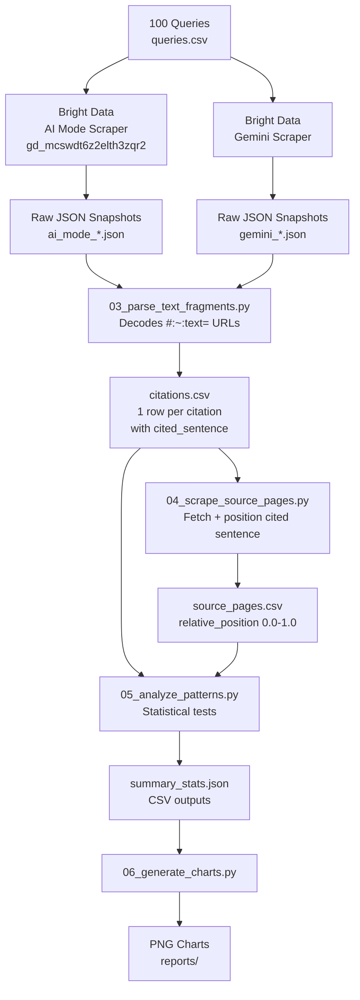
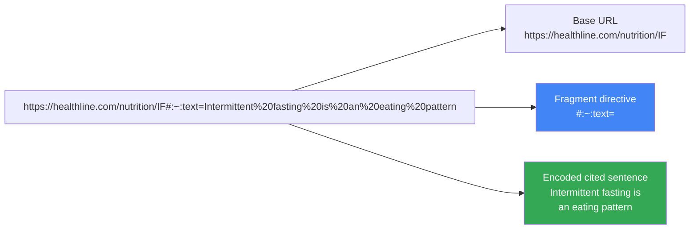
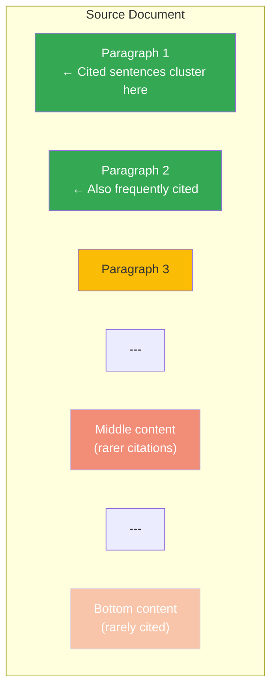
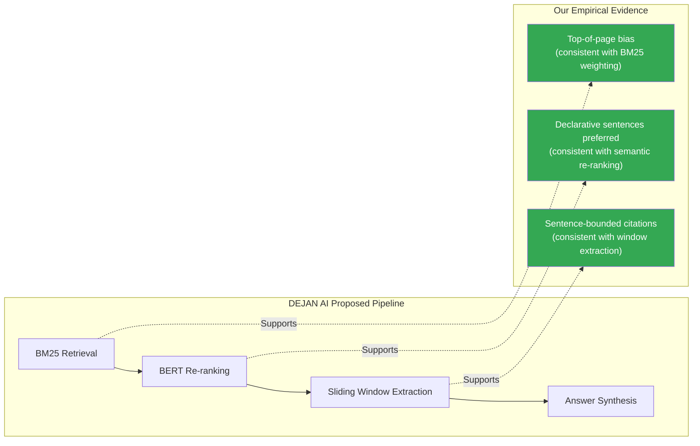
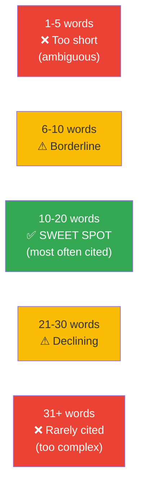

# Mermaid Diagrams — Source Files

These diagrams are embedded in the article and README using GitHub's native Mermaid rendering.
Copy any diagram block into a `.md` file and GitHub will render it automatically.

---

## Diagram 1: Full Pipeline Architecture



---

## Diagram 2: Text Fragment URL Anatomy



---

## Diagram 3: Citation Position Hypothesis



---

## Diagram 4: AI Mode vs Gemini Coverage

```mermaid
venn
    title Citation Domain Overlap: AI Mode vs Gemini
    "AI Mode Only" : 40
    "Shared" : 60
    "Gemini Only" : 35
```

---

## Diagram 5: DEJAN Pipeline vs Our Evidence



---

## Diagram 6: Sentence Length Optimal Zone


