# Mermaid Diagrams — May 2026 Edition

These diagrams accompany the May 2026 study and are embedded in the long-form article and README. GitHub renders Mermaid blocks natively.

---

## Diagram 1 — Full Pipeline Architecture (5,000 queries × 6 platforms)

```mermaid
flowchart TD
    A["queries_5k.csv<br/>5,000 queries × 25 verticals"] --> B1["01_collect_ai_mode.py<br/>Bright Data AI Mode"]
    A --> B2["02_collect_gemini.py<br/>Bright Data Gemini"]
    A --> B3["02_collect_chatgpt.py<br/>Bright Data ChatGPT"]
    A --> B4["02_collect_perplexity.py<br/>Bright Data Perplexity"]
    A --> B5["02_collect_copilot.py<br/>Bright Data Copilot"]
    A --> B6["02_collect_grok.py<br/>Bright Data Grok"]
    A --> S["02b_collect_serp.py<br/>Bright Data SERP API"]
    B1 --> P["03_parse_text_fragments.py"]
    B2 --> P
    B3 --> P
    B4 --> P
    B5 --> P
    B6 --> P
    P --> C["citations.csv<br/>153,425 rows"]
    P --> AN["answers.csv<br/>13,710 rows"]
    S --> SR["serp.csv<br/>44,348 rows / 4,998 queries"]
    C --> SC["04_scrape_source_pages.py<br/>fragment-bearing URLs only"]
    SC --> SP["source_pages.csv<br/>11,344 rows · 87.9% match"]
    C --> AZ["05_analyze_patterns.py"]
    SR --> AZ
    SP --> AZ
    AZ --> ST["data/analysis/*.json + *.csv"]
    AZ --> RD["07_readability_analysis.py"]
    AZ --> FR["08_freshness_analysis.py"]
    ST --> CH["06_generate_charts.py"]
    CH --> R["reports/*.png"]
```

---

## Diagram 2 — How Text Fragments Used to Work (and Where They Still Do)

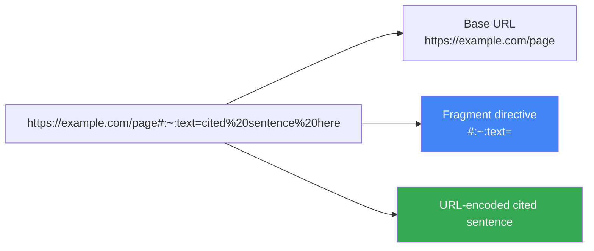

**May 2026 reality:**

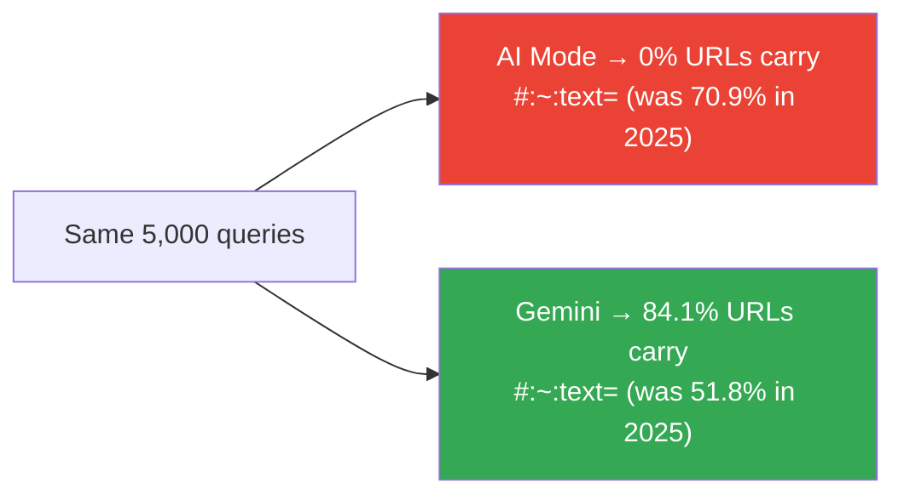

---

## Diagram 3 — Where Cited Sentences Live in the Source Page

Mean position **0.3704** across 9,968 fragment-resolved citations (t = −63.45 vs 0.50, p < 0.001).

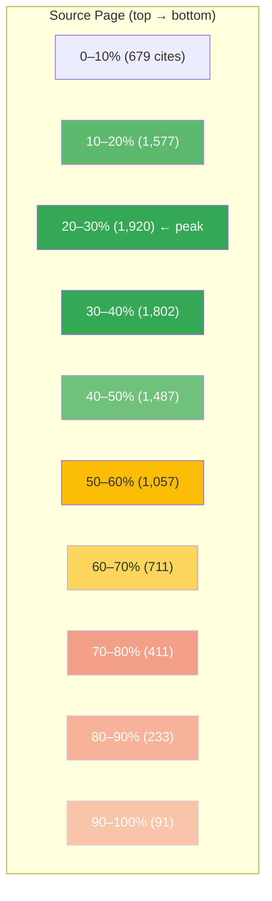

---

## Diagram 4 — AI Mode vs Gemini Domain Overlap

Jaccard similarity = **0.0466**.

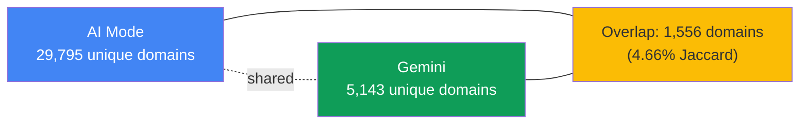

---

## Diagram 5 — Citation vs Organic SERP Alignment

For 153,425 citations, joined to fresh organic top-10 SERPs from the same queries:

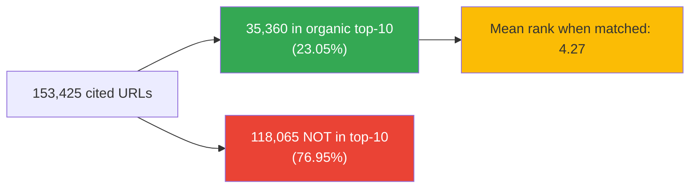

By platform (URL in organic top-10):

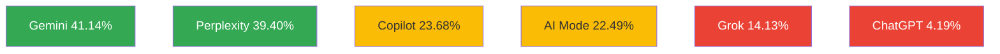

---

## Diagram 6 — Cited Sentence Length: Hard 18-Word Ceiling

Across 11,346 sentence-level extractions:

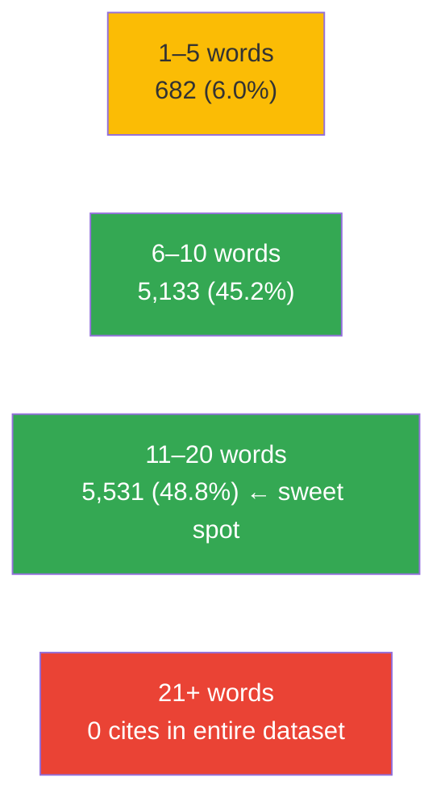

Mean = 9.27 words · Median = 10 · IQR 7–11 · Max = 18.

---

## Diagram 7 — Readability Is Bimodal

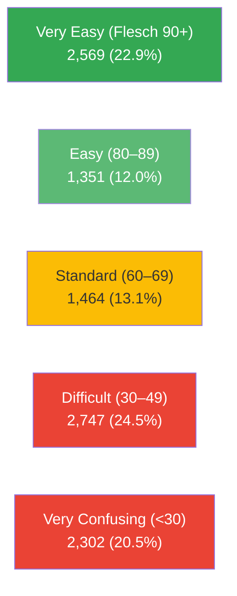

Cited content is bimodal — elementary or technical. Mid-register prose is rare.

---

## Diagram 8 — Freshness: Median Page Is ~10 Months Old

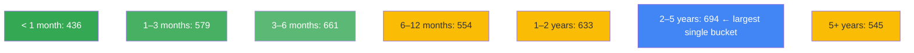

Median age = 298 days · 61.9% of dated cited URLs published in 2025–2026 · Long tail back to 1998.

---

## Diagram 9 — Per-Platform Personality

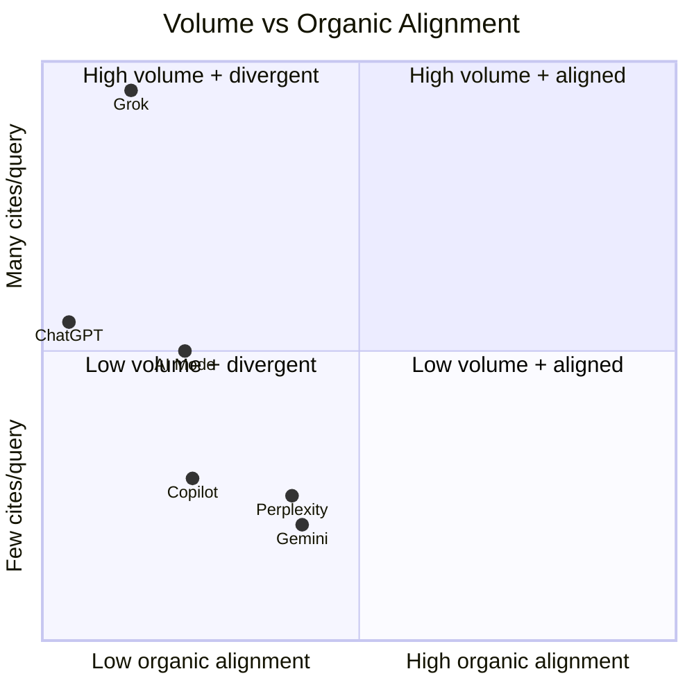
